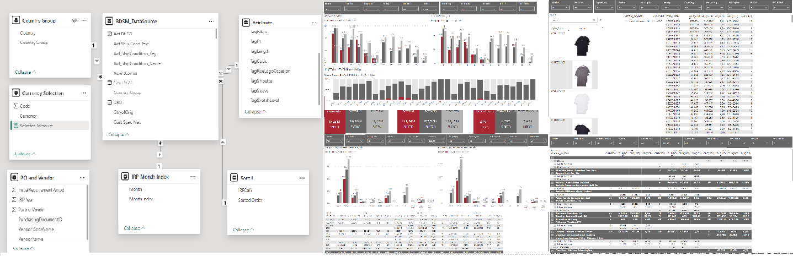

# PowerBI-Reports, Model, Measures

## Vendor Score Card - Summary Report


```
Dax Measures-

Rank 2 = RANKX(
               CROSSJOIN(ALL(BSMD[Real_Vendor]),ALL(BSMD[NewVendor_Name]),ALL('VN- Date of Activation VN'[Active]),ALL(BSMD[SourcingOffice]),ALL(BSMD[Vendor_Country]))
               ,[#Score SS 2022],,DESC
	       )

---
Logistic and Delivery Performance POF Score AW2021 = 
var period="SS 2022"
return 
CALCULATE(sum('POF Main'[Score]),FILTER('POF Main','POF Main'[Period]=period),FILTER('POF Main','POF Main'[KPI Category]="Logistics and Delivery Performance"))

---
POF Score SS2021 Ratio = 
var period="SS 2021"
return 
CALCULATE(sum('POF Main'[Score])/60,FILTER('POF Main','POF Main'[Period]=period))

---
POF Format = 
CALCULATE(SUM('POF Main'[POF Conditional Format]),
          FILTER('POF Main','POF Main'[Period]="SS 2022")
         )

---
Rankx = 
CALCULATE(
        DISTINCTCOUNT('POF Main'[Index]),
        FILTER(
        all('POF Main'),
        'POF Main'[Vendor Code]=EARLIER('POF Main'[Vendor Code]) && 'POF Main'[Period] = "SS 2022"&&
        'POF Main'[Index]>EARLIER('POF Main'[Index])))+1

---
POF History AW 2021 = 
var Score = CALCULATE(SUM('POF Score History'[POF Score]),FILTER('POF Score History','POF Score History'[Period] = "AW 2021"))
return IF(Score = BLANK(),"",Score)

---
NewVendor_Name = SWITCH(TRUE(),
                        'Primary Vendor Key'[Vendor] = "505107","Kipas Pazarlama Ve Ticaret A.S.",
                        'Primary Vendor Key'[Vendor] = "506095","Winpro Enterprises Co. Ltd.",
                        'Primary Vendor Key'[NewVendor_Name1]
      )

---
Commercial Business Management Performance = IF('Summary Commercial Table'[Score] > 7,"1.Excellent",
                                             IF('Summary Commercial Table'[Score] > 5,"2.Above Average",
                                             IF('Summary Commercial Table'[Score] > 3,"3.Average",                                                
                                             IF('Summary Commercial Table'[Score] > 1,"4.Need Improvement","5.Unacceptable"))))

---


```


## Business Volume

```
Dax Measures-

DivSetPlus = 
var gender = IF(MID(BDSM_DataSource[Style_Code],6,1) = "1","W",IF(MID(BDSM_DataSource[Style_Code],6,1)="2","M"))
var div = IF(MID(BDSM_DataSource[Style_Code],4,1) = "C","DC",IF(MID(BDSM_DataSource[Style_Code],4,1) ="E","CA"))
return IF(BDSM_DataSource[DivSet] = "ACC","ACC "&gender&div,BDSM_DataSource[DivSet])

Shoe_Gender = SWITCH(MID(BDSM_DataSource[Style_Code],4,3),
                         "EK1","Woman",
                         "EK2","Men",
                         "EKK","Kids", 
                         "Other")

```

```
SQL Script-
declare @StartIRP as varchar(10)
set @StartIRP='2022-01'

declare @TY as varchar(10)
set @TY=year(GETDATE())+1

SELECT m.[Purch Doc No] as PO
      ,m.[Style Key] as Style_Code
      ,concat(m.[Style Key],m.[Color (Coex) Key]) as 'Option'
      ,m.[Ship Win] as ShipWindow
      ,m.[Act Ship Cond Text]
      ,m.[Theme ID]
      ,m.[Cust Spec Mat]
      ,m.[Rep Vendor Key]
      ,m.[Rep Vendor Text]
-------Product Mapping--------
      ,m.[Div Set] as Prod_Label
      ,case when m.[Div Set] in ('WCA','EDC','WCO','TRD') then 'Women'
            when m.[Div Set] in ('MCA','MDC','MCO') then 'Men'
	    when m.[Div Set] ='ACC' then 'ACC'
	    else 'LIFESTYLE' end as Prod_Gender
      ,m.[SupplyCategoryName] as Prod_SupplyCategory
      ,m.[Mat Grp] as Prod_MaterialGroup
      ,m.[Prod Cls Text] as Prod_Cluster_Name
      ,m.[ProductClusterName] as ProductClusterName2
-------IRP formatting--------
      ,m.[IRP CalYMth] as IRP_CalYMth
      ,concat(right(m.[IRP CalYMth],4),'-',left(m.[IRP CalYMth],2)) as IRP
      ,format(cast(left(m.[IRP CalYMth],2) as numeric), '00') as [IRPMonth]
      ,concat('FY',case when right(m.[IRP CalYMth],4)=@TY-1 then @TY-1
                        when right(m.[IRP CalYMth],4)=@TY-2 then @TY-2
                        when right(m.[IRP CalYMth],4)=@TY-3 then @TY-3
                        when right(m.[IRP CalYMth],4)=@TY-4 then @TY-4
                        else @TY
                        end ) as [New_FY]  
      ,Concat('FY',[IRP FY Key],'/',[IRP FY Key]+1) as Old_FY
-------loc--------
       ,m.[Sourcing office] as SourcingOffice 
       ,m.[Agent Comm] as AgentComm
       ,m.[Ctry of Orig] as CountryOfOrigin
       ,m.[Vendor Key] as Vendor_Code
       ,m.[Vendor Text] as Vendor_Name
       ,m.[Vendor Country] as Vendor_Country
       ,cast (m.[Purch Doc Entry Date] as date) as [PurchDocEntry_Date]
       ,m.[POF Key] as POF_Code
       ,m.[POF Text] as POF_Name
       ,m.[Act Ship Cond Key] as Act_ShipCondition_Key
       ,m.[Act Ship Cond Text] as Act_ShipCondition_Name
-------Key figure--------
       ,[EES PUR@PCS] as EES_PUR_PCS
       ,[EES PUR@FOB] as 'EES_PUR_FOB_€'
       ,[EES PUR@FOB USD] as 'EES_PUR_FOB_$'
       ,[EES PUR@PCSAB] as EES_PUR_PCS_AB
       ,[EES REC@PCS] as EES_REC@PCS
       ,[EES PUR@FOB D/C] as EES_PUR@FOB_DC
       ,[EES PUR@FOB/PCS] as 'EES_PUR_FOB/PCS_€'
       ,[EES PUR@FOB/PCS USD] as 'EES_PUR_FOB/PCS_$'
       ,[EES PUR@LLC] as [EES_PUR_LLC]
       ,[EES PUR@LLC/PCS] as [EES_PUR_LLC/PCS]
-------Date--------
       ,[Act Dt ZF (Goods Ready Date)] as 'CRD'
       ,[Plan Dt ZG (Cargo Receipt at Hub)] as 'Plan Dt ZG'
       ,[Con Dt ZG (Cargo Receipt at Hub)] as 'Con Dt ZG'
       ,[Rev Dt ZG (Cargo Receipt at Hub)] as 'Rev Dt ZG'
       ,[Act Dt ZG  (Cargo Receipt at Hub)] as 'Act Dt ZG'           
       ,[EES PUR@UPR/PCS]
       ,[EES PUR@UPR]
       ,[EES PUR@UPR iV]
       ,[CustomerDestination]
FROM [BSMD_Data].[Rep].[BSMD_AllData] as m
where 
concat(right(m.[IRP CalYMth],4),'-',left(m.[IRP CalYMth],2)) >= @StartIRP
```
