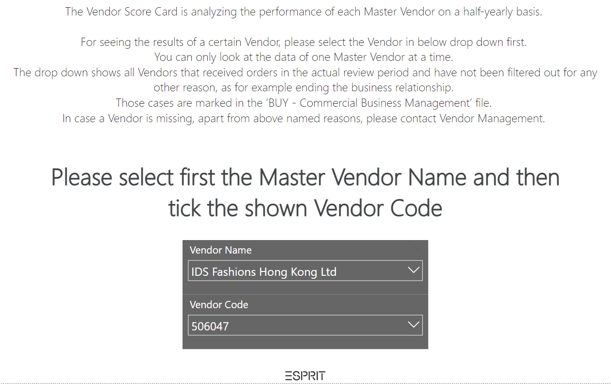
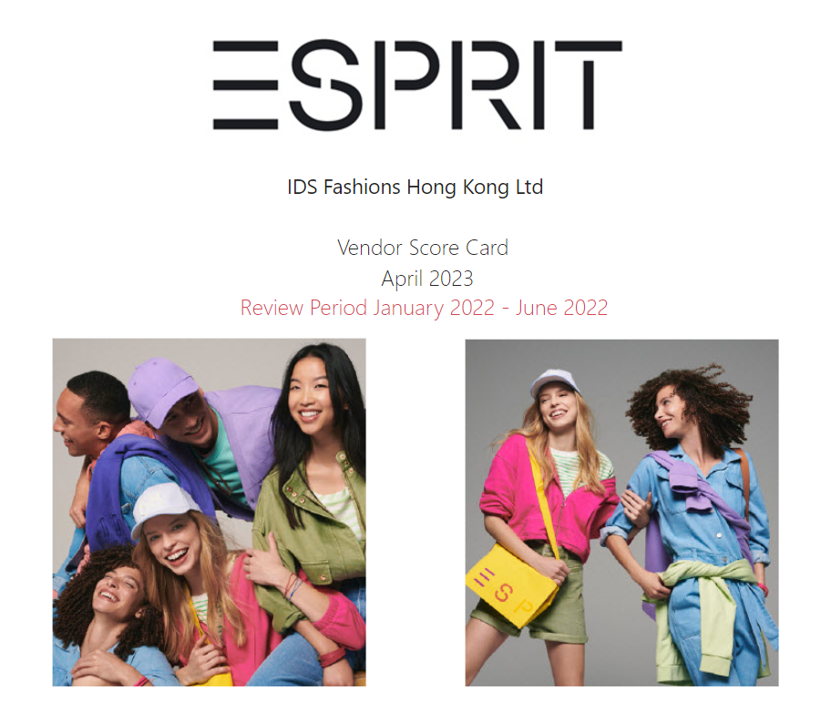
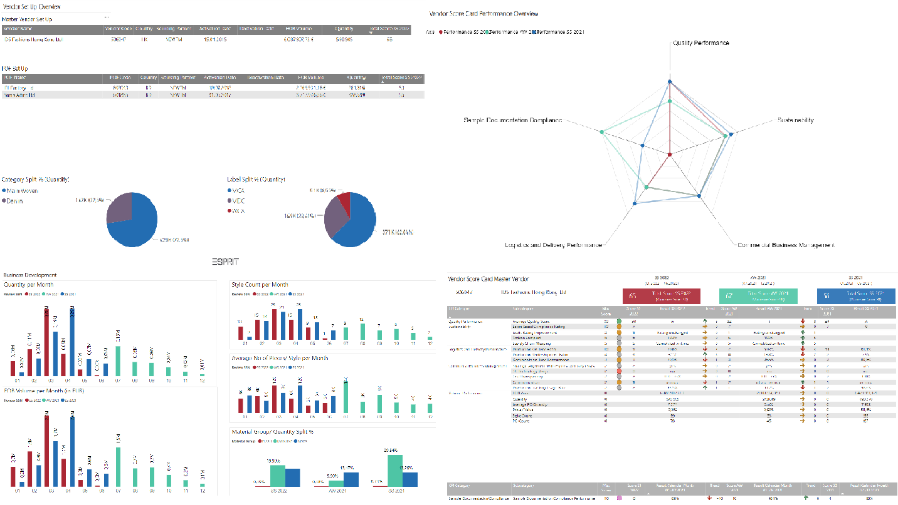
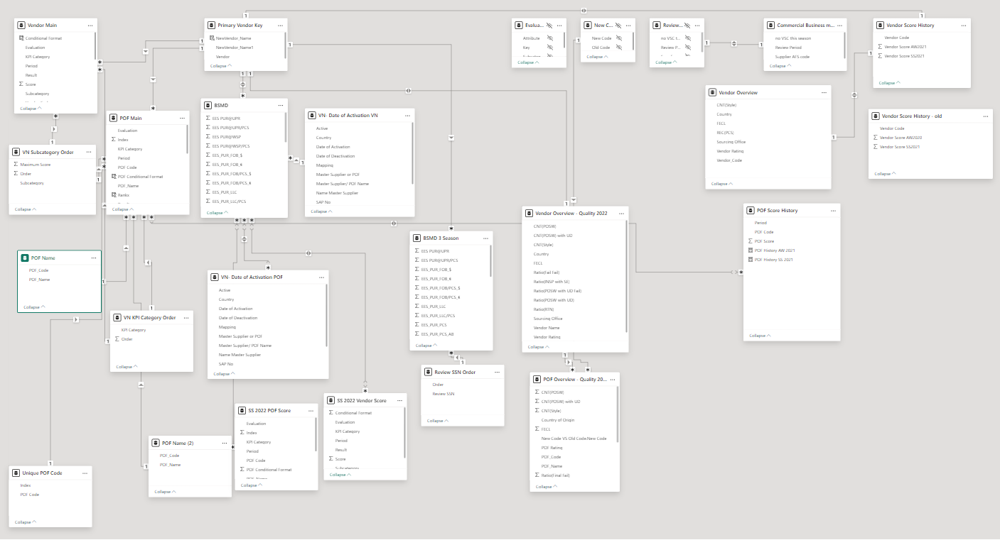
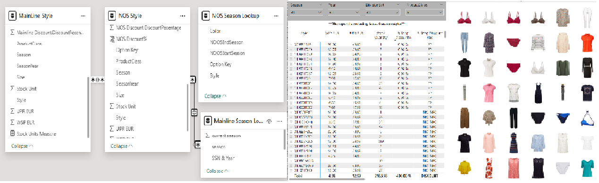
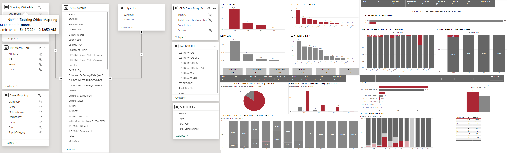
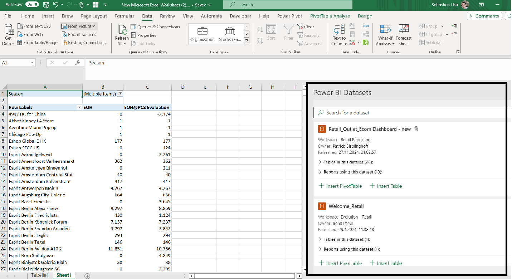

# PowerBI-Reports, Model, Measures

## Vendor Score Card
Vendor Score card is an index to provide information of vendors ranking for our sourcing team. It combines different data source then calculated the scores for different departments. 
Users just need to search the vendor name then other information will updated and calculate across the tabs.
-   


-

-

-
The data model behind the file.
-

-
Some useful dax measures.
```
Dax Measures-

Rank 2 = RANKX(
               CROSSJOIN(ALL(BSMD[Real_Vendor]),ALL(BSMD[NewVendor_Name]),ALL('VN- Date of Activation VN'[Active]),ALL(BSMD[SourcingOffice]),ALL(BSMD[Vendor_Country]))
               ,[#Score SS 2022],,DESC
	       )

---
Logistic and Delivery Performance POF Score AW2021 = 
var period="SS 2022"
return 
CALCULATE(sum('POF Main'[Score]),FILTER('POF Main','POF Main'[Period]=period),FILTER('POF Main','POF Main'[KPI Category]="Logistics and Delivery Performance"))

---
POF Score SS2021 Ratio = 
var period="SS 2021"
return 
CALCULATE(sum('POF Main'[Score])/60,FILTER('POF Main','POF Main'[Period]=period))

---
POF Format = 
CALCULATE(SUM('POF Main'[POF Conditional Format]),
          FILTER('POF Main','POF Main'[Period]="SS 2022")
         )

---
Rankx = 
CALCULATE(
        DISTINCTCOUNT('POF Main'[Index]),
        FILTER(
        all('POF Main'),
        'POF Main'[Vendor Code]=EARLIER('POF Main'[Vendor Code]) && 'POF Main'[Period] = "SS 2022"&&
        'POF Main'[Index]>EARLIER('POF Main'[Index])))+1

---
POF History AW 2021 = 
var Score = CALCULATE(SUM('POF Score History'[POF Score]),FILTER('POF Score History','POF Score History'[Period] = "AW 2021"))
return IF(Score = BLANK(),"",Score)

---
NewVendor_Name = SWITCH(TRUE(),
                        'Primary Vendor Key'[Vendor] = "505107","Kipas Pazarlama Ve Ticaret A.S.",
                        'Primary Vendor Key'[Vendor] = "506095","Winpro Enterprises Co. Ltd.",
                        'Primary Vendor Key'[NewVendor_Name1]
      )

---
Commercial Business Management Performance = IF('Summary Commercial Table'[Score] > 7,"1.Excellent",
                                             IF('Summary Commercial Table'[Score] > 5,"2.Above Average",
                                             IF('Summary Commercial Table'[Score] > 3,"3.Average",                                                
                                             IF('Summary Commercial Table'[Score] > 1,"4.Need Improvement","5.Unacceptable"))))

```
## Clearance Stock Report with Images Data
Clearance stock report is providing information of the leftover stock for wholesale merchandise management. Combining images with stock information let the merchandise managers decide which options to be sent to the business partners.
-

-
Some dax measures used in the report.
```
Dax Measures-

B-Shop Discount% = SWITCH('MainLine Style'[Mainline Discount.B-Shop Discount Flag],"NO INFO"
                          ,BLANK(),'MainLine Style'[Mainline Discount.DiscountPecentage]
                         )

```
the SQL script behind the data source.
```
SQL Script-

SELECT m.Style 
      ,[Color]
      ,CONCAT ([Size],[Length]) as 'Size'
      ,[EAN11] AS 'EAN'
      ,[WholesaleSellingPrice eV LC] as 'WSP EUR'
      ,[PRI(UPRiV)lc] as 'UPR EUR'
      ,[StockQuantity] As 'Stock Unit'
      ,left(m.Style,2) as 'Season'
      ,[Description] as 'ProductClass'
      ,d.[DivisionSet]
      ,[SeasonYear]

FROM [Staging].[SupplyChain].[ATPStock] as m
left join (
SELECT [Style]
      ,[PRI(UPRiV)lc]
FROM [Reporting].[MasterDataViews].[Prices_Style_Country_Currency_UPR_current_OBSOLETE]
where Country = 'DE' and LocalCurrency = 'EUR'
) as s
on m.Style = s.Style
 
left join (
SELECT [style]
      ,[WholesaleSellingPrice eV LC]
FROM [Reporting].[WholesaleViews].[PriceWholesalePriceCountryStyle]
where Country = 'DE' and Currency = 'EUR' and ValidTo = '9999-12-31'
) as w 
on m.Style = w.[style]

left join [DataLake].[master].[style] as d
on m.Style =d.Style

left join [DataLake].[AFS].[ProductClass] as p
on d.ProductClass = p.ProductClass

left join [Reporting].[MasterDataViews].[ProductStyle] as f
on m.Style = f.Style

where (left(m.Style,3) not in ('032','022','012','121','111','101')) and (LEFT(m.Style,2) not in ('99'))

SQL script for the seasonality for product.
---
SELECT distinct([Style]) as 'Style'
      ,min([Color]) as 'Color' 
      ,min([NOOSEndSeason]) as 'NOOSEndSeason' 
      ,min([NOOSStartSeason]) as 'NOOSStartSeason'

FROM [Reporting].[MasterDataViews].[ProductArticle]
where LEFT(Style,2) in ('99') and NOOSEndSeason is not NULL and NOOSEndSeason not in ('')
group by [Style],[Color],[NOOSEndSeason],[NOOSStartSeason]
```

## Business Volume
Business Volume report summaries all the information after sourcing team placed the order.
-

-
some measures used in the report. 

```
Dax Measures-

DivSetPlus = 
var gender = IF(MID(BDSM_DataSource[Style_Code],6,1) = "1","W",IF(MID(BDSM_DataSource[Style_Code],6,1)="2","M"))
var div = IF(MID(BDSM_DataSource[Style_Code],4,1) = "C","DC",IF(MID(BDSM_DataSource[Style_Code],4,1) ="E","CA"))
return IF(BDSM_DataSource[DivSet] = "ACC","ACC "&gender&div,BDSM_DataSource[DivSet])

Shoe_Gender = SWITCH(MID(BDSM_DataSource[Style_Code],4,3),
                         "EK1","Woman",
                         "EK2","Men",
                         "EKK","Kids", 
                         "Other")

```

SQL script used for the data source.
```
SQL Script-
declare @StartIRP as varchar(10)
set @StartIRP='2022-01'

declare @TY as varchar(10)
set @TY=year(GETDATE())+1

SELECT m.[Purch Doc No] as PO
      ,m.[Style Key] as Style_Code
      ,concat(m.[Style Key],m.[Color (Coex) Key]) as 'Option'
      ,m.[Ship Win] as ShipWindow
      ,m.[Act Ship Cond Text]
      ,m.[Theme ID]
      ,m.[Cust Spec Mat]
      ,m.[Rep Vendor Key]
      ,m.[Rep Vendor Text]
-------Product Mapping--------
      ,m.[Div Set] as Prod_Label
      ,case when m.[Div Set] in ('WCA','EDC','WCO','TRD') then 'Women'
            when m.[Div Set] in ('MCA','MDC','MCO') then 'Men'
	    when m.[Div Set] ='ACC' then 'ACC'
	    else 'LIFESTYLE' end as Prod_Gender
      ,m.[SupplyCategoryName] as Prod_SupplyCategory
      ,m.[Mat Grp] as Prod_MaterialGroup
      ,m.[Prod Cls Text] as Prod_Cluster_Name
      ,m.[ProductClusterName] as ProductClusterName2
-------IRP formatting--------
      ,m.[IRP CalYMth] as IRP_CalYMth
      ,concat(right(m.[IRP CalYMth],4),'-',left(m.[IRP CalYMth],2)) as IRP
      ,format(cast(left(m.[IRP CalYMth],2) as numeric), '00') as [IRPMonth]
      ,concat('FY',case when right(m.[IRP CalYMth],4)=@TY-1 then @TY-1
                        when right(m.[IRP CalYMth],4)=@TY-2 then @TY-2
                        when right(m.[IRP CalYMth],4)=@TY-3 then @TY-3
                        when right(m.[IRP CalYMth],4)=@TY-4 then @TY-4
                        else @TY
                        end ) as [New_FY]  
      ,Concat('FY',[IRP FY Key],'/',[IRP FY Key]+1) as Old_FY
-------loc--------
       ,m.[Sourcing office] as SourcingOffice 
       ,m.[Agent Comm] as AgentComm
       ,m.[Ctry of Orig] as CountryOfOrigin
       ,m.[Vendor Key] as Vendor_Code
       ,m.[Vendor Text] as Vendor_Name
       ,m.[Vendor Country] as Vendor_Country
       ,cast (m.[Purch Doc Entry Date] as date) as [PurchDocEntry_Date]
       ,m.[POF Key] as POF_Code
       ,m.[POF Text] as POF_Name
       ,m.[Act Ship Cond Key] as Act_ShipCondition_Key
       ,m.[Act Ship Cond Text] as Act_ShipCondition_Name
-------Key figure--------
       ,[EES PUR@PCS] as EES_PUR_PCS
       ,[EES PUR@FOB] as 'EES_PUR_FOB_€'
       ,[EES PUR@FOB USD] as 'EES_PUR_FOB_$'
       ,[EES PUR@PCSAB] as EES_PUR_PCS_AB
       ,[EES REC@PCS] as EES_REC@PCS
       ,[EES PUR@FOB D/C] as EES_PUR@FOB_DC
       ,[EES PUR@FOB/PCS] as 'EES_PUR_FOB/PCS_€'
       ,[EES PUR@FOB/PCS USD] as 'EES_PUR_FOB/PCS_$'
       ,[EES PUR@LLC] as [EES_PUR_LLC]
       ,[EES PUR@LLC/PCS] as [EES_PUR_LLC/PCS]
-------Date--------
       ,[Act Dt ZF (Goods Ready Date)] as 'CRD'
       ,[Plan Dt ZG (Cargo Receipt at Hub)] as 'Plan Dt ZG'
       ,[Con Dt ZG (Cargo Receipt at Hub)] as 'Con Dt ZG'
       ,[Rev Dt ZG (Cargo Receipt at Hub)] as 'Rev Dt ZG'
       ,[Act Dt ZG  (Cargo Receipt at Hub)] as 'Act Dt ZG'           
       ,[EES PUR@UPR/PCS]
       ,[EES PUR@UPR]
       ,[EES PUR@UPR iV]
       ,[CustomerDestination]
FROM [BSMD_Data].[Rep].[BSMD_AllData] as m
where 
concat(right(m.[IRP CalYMth],4),'-',left(m.[IRP CalYMth],2)) >= @StartIRP
```
## Sample Management Report
After the buyers place the sample orders, the sample management report provides information of ordering quantity and arriving time.
-

```
Dax Measures-

Div Plus = 
var gender = IF(MID('APLL Sample'[Material #],6,1) = "1","W",IF(MID('APLL Sample'[Material #],6,1)="2","M"))
var div = IF(MID('APLL Sample'[Material #],4,1) = "C","DC",IF(MID('APLL Sample'[Material #],4,1) ="E","CA"))
return IF('APLL Sample'[Label] = "ACC","ACC "&gender&div,'APLL Sample'[Label])

---
Gender_Slicer = SWITCH('APLL Sample'[Label],
                       "WCA","Women",
                       "WCO","Women",
                       "EDC","Women",
                       "MCA","Men",
                       "MCO","Men",
                       "MDC","Men",
                       "ACC"
                      )

---
In_time = if('APLL Sample'[In_transit]="In Transit","",
          if(and('APLL Sample'[Initial Conf Handover Dt (Conf ZG)]='APLL Sample'[Estimated Ex-Factory Date (rev ZG) SKU],'APLL Sample'[In_transit]=""),"In Time","")
)

---
Style_option_Ratio = 
var style=DISTINCTCOUNT('APLL Sample'[Material #])
var option=DISTINCTCOUNT('APLL Sample'[Option])
return
option/style

---
Supplier_Performance = 
var crd=DATEDIFF('APLL Sample'[Initial Conf Handover Dt (Conf ZG)],'APLL Sample'[Estimated Ex-Factory Date (rev ZG) SKU],DAY)
return if(crd<0,"On time",if(crd=0,"On time", if(crd<=3,"0-3ds", if(crd<=7,"4-7ds",">7day"))))
```

```
SQL Script-

SELECT distinct [Style]
      ,case when [TargetGroup]= '1' then 'W'
	    when [TargetGroup]= '2' then 'M'
	    else 'LS'
            end as Gender
      ,left([ORIGINAL_SEASON_NOMINAL_DATE],6) as Season
      ,m.[MaterialGroup]
      ,sc.[Description] as [SupplyCategory]
      ,div.[OldDivisionSet] as DivisionSet
      ,class.[Description] as ProductClass

FROM [DataLake].[master].[style] as m
left join afs.ProductClass as class on class.ProductClass=m.ProductClass
left join [DataLake].[AFS].[DivisionSet] as div on div.[ProductHierarchy]= m.[MerchandiseHierarchy5] 
left join [DataLake].[AFS].[SupplyCategory] as sc on sc.[SupplyCategory]=class.[SupplyCategoryId]

where sc.[Description]  <>'' and div.[OldDivisionSet] not in ('SHO') and ((left(Style,3) in ('074','084','094','104'))or(left(Style,2) in ('99')))

---
SELECT [Style]
      ,sum([PUR(PCS)]) as ttlpcs
      ,sum([PUR(FOB)]) as ttlfob
      ,round(sum([PUR(FOB)])/sum([PUR(PCS)]),4) as FOB_PCS

FROM [Reporting].[SupplyChainViews].[PurchasingOrderConfirmationShipment]
Where Plant = 'DE02' and PurchasingDocumentType = 'ZSAO' and ((left(Style,3) in ('074','084','094','104'))or(left(Style,2) in ('99'))) 
group by Style
order by Style
```
## Data Model Usage
After publishing the models to PBI workspace, all users can access to the data model via PBI desktop or excel pivot tables.
For colleagues who do not use BI tools, collecting data models using Excel pivot tables provides a flexible workaround.
-

-


